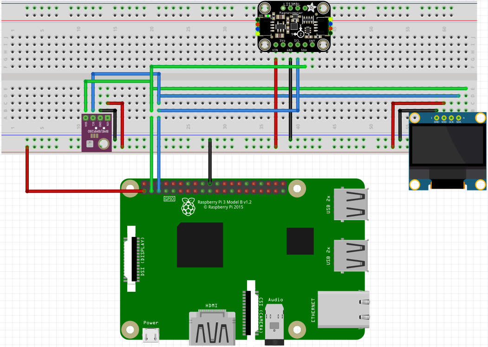

## About the project 

The main functions include sending data from the database to AWS and receiving commands from AWS. In addition, the project involves interaction with sensors, such as the BMP280 for temperature and pressure measurement and the STEVAL-MKI137V1 for magnetometer readings. The SH1106 display is also part of the project to show temperature and pressure.

## Getting Started

Clone the repo

```sh
  git clone git@github.com:bohdan-kharytonov/tst_weather.git
```
Run Podman to create a container 

```sh
  cd .yocto
  podman build . -t tst_weather
  podman run -it --rm -v "$(pwd)"/build:/poky/build:Z --userns=keep-id tst_weather
```
build yocto image 
```sh
    source oe-init-build-env
```

You can now run 'bitbake <target>'

Common targets are:

- core-image-minimal
- core-image-full-cmdline
- core-image-sato
- meta-toolchain
- meta-ide-support


```sh
  bitbake core-image-minimal-xfce
```

After successfully building, you can find your image in the 
```sh
  cd build/tmp/deploy/images/raspberrypi4-64/
```

## Connection 

